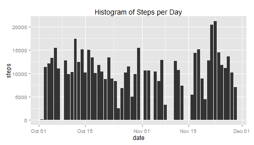
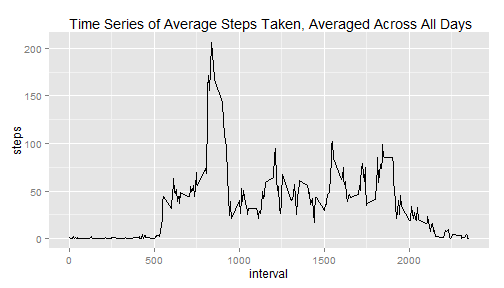
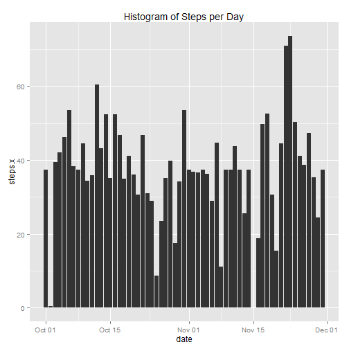
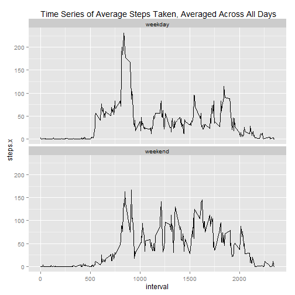

## Loading and preprocessing the data

```r
library(ggplot2)
Sys.setlocale("LC_TIME", "English")
```

```
## [1] "English_United States.1252"
```

```r
data<-read.csv(unz("activity.zip", "activity.csv"))
data <- transform(data, date = as.POSIXct(date))
```
## What is mean total number of steps taken per day?

```r
sumpd <-tapply(data$steps, data$date, sum)
sumpd <- data.frame(date=names(sumpd),steps = sumpd,row.names=NULL)
sumpd <- transform(sumpd , date = as.POSIXct(date))
par(mar = c(5, 4, 1, 1),las =1)
qplot(date,steps,data = sumpd,geom = "histogram",stat="identity",main = "Histogram of Steps per Day")
```

```
## Warning: Removed 8 rows containing missing values (position_stack).
```

 

Report the mean and median of the total number of steps taken per day


```r
mean(sumpd$steps,na.rm= TRUE)
```

```
## [1] 10766.19
```

```r
median(sumpd$steps, na.rm = TRUE)
```

```
## [1] 10765
```


## What is the average daily activity pattern?

```r
avgin <- tapply(data$steps, data$interval, mean,na.rm = TRUE)
avgin <- data.frame(interval=names(avgin),steps = avgin,row.names=NULL)
par(mar = c(5, 4, 1, 1),las =1)
qplot(interval,steps,data=data,geom = "line",stat="summary",fun.y = "mean",main =" Time Series of Average Steps Taken, Averaged Across All Days")
```

```
## Warning: Removed 2304 rows containing missing values (stat_summary).
```

 

This is the max average number of steps and interval in 5-minute interval.

```r
max(avgin$steps)
```

```
## [1] 206.1698
```


```r
names(which.max(avgin$steps))
```

```
## [1] "835"
```

```r
mas <- names(which.max(avgin$steps))
```
835 minute in 5-minute interval contains the maximum number of steps on average across all the days in the dataset.

## Imputing missing values

Calculate and report the total number of missing values in the dataset.

```r
sum(is.na(data))
```

```
## [1] 2304
```

Provide the mean for that 5-minute interval to missing values in the dataset.
Plot histogram with filled missing values.

```r
ndata<-merge(data,avgin,by = "interval")
ndata$steps.x[is.na(ndata$steps.x)]<-ndata$steps.y[is.na(ndata$steps.x)]
ndata<-ndata[ order(ndata[,3]),]
par(mar = c(5, 4, 1, 1),las =1)
qplot(date,steps.x,data = ndata,geom = "histogram",stat="summary",fun.y = "mean",main = "Histogram of Steps per Day")
```

 

Report the mean and median of the total number of steps taken per day with filled missing values.


```r
nsumpd<-tapply(ndata$steps.x, ndata$date,sum)
nsumpd <- data.frame(date=names(nsumpd),steps = nsumpd,row.names=NULL)
mean(nsumpd$steps)
```

```
## [1] 10766.19
```

```r
median(nsumpd$steps)
```

```
## [1] 10766.19
```
The impact of imputing missing data:
By imputing missing data, 
the median differs from the estimates from the first part of the assignment, 
but the mean keeps same.

## Are there differences in activity patterns between weekdays and weekends?

```r
ndata$weekday<-weekdays(ndata$date)
ndata$weekday<- ifelse(ndata$weekday %in% c("Saturday", "Sunday"), "weekend", "weekday")
par(mar = c(5, 4, 1, 1),las =1)
qplot(interval,steps.x,data=ndata,geom = "line",stat="summary",fun.y = "mean",main =" Time Series of Average Steps Taken, Averaged Across All Days",facets = .~
weekday)+facet_wrap(~weekday,nrow = 2)
```

 

The weekday steps apparently gather in certain part of interval.
The weekend steps separate in many interval.

