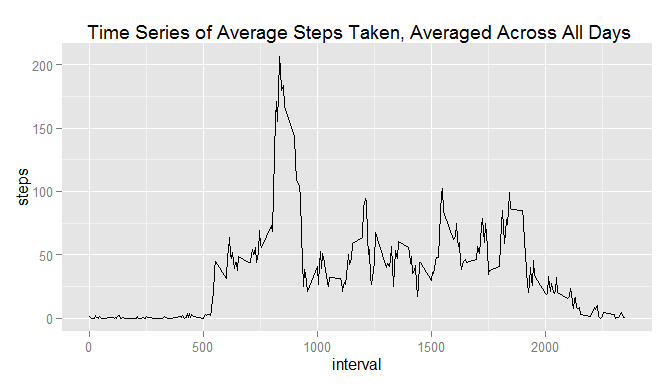

# Reproducible Research: Peer Assessment 1


## Loading and preprocessing the data

```r
library(ggplot2)
Sys.setlocale("LC_TIME", "English")
```

```
## [1] "English_United States.1252"
```

```r
data<-read.csv(unz("activity.zip", "activity.csv"))
data <- transform(data, date = as.POSIXct(date))
```
## What is mean total number of steps taken per day?

```r
sumpd<-tapply(data$steps, data$date, sum)
sumpd <- data.frame(date=names(sumpd),steps = sumpd,row.names=NULL)
sumpd  <- transform(sumpd , date = as.POSIXct(date))
par(mar = c(5, 4, 1, 1),las =1)
qplot(date,steps,data = sumpd,geom = "histogram",stat="identity",main = "Histogram of Steps per Day")
```

```
## Warning: Removed 8 rows containing missing values (position_stack).
```

 

```r
mean(sumpd$steps,na.rm= TRUE)
```

```
## [1] 10766.19
```

```r
median(sumpd$steps, na.rm = TRUE)
```

```
## [1] 10765
```


## What is the average daily activity pattern?

```r
avgin<-tapply(data$steps, data$interval, mean,na.rm = TRUE)
avgin <- data.frame(interval=names(avgin),steps = avgin,row.names=NULL)
par(mar = c(5, 4, 1, 1),las =1)
qplot(interval,steps,data=data,geom = "line",stat="summary",fun.y = "mean",main =" time series of average number of steps taken, averaged across all days")
```

```
## Warning: Removed 2304 rows containing missing values (stat_summary).
```

 

This is the max average number of steps in 5-minute interval.

```r
max(avgin$steps)
```

```
## [1] 206.1698
```


```r
mas <- names(which.max(avgin$steps))
```
835 in 5-minute interval contains the maximum number of steps on average across all the days in the dataset.

## Imputing missing values


## Are there differences in activity patterns between weekdays and weekends?
